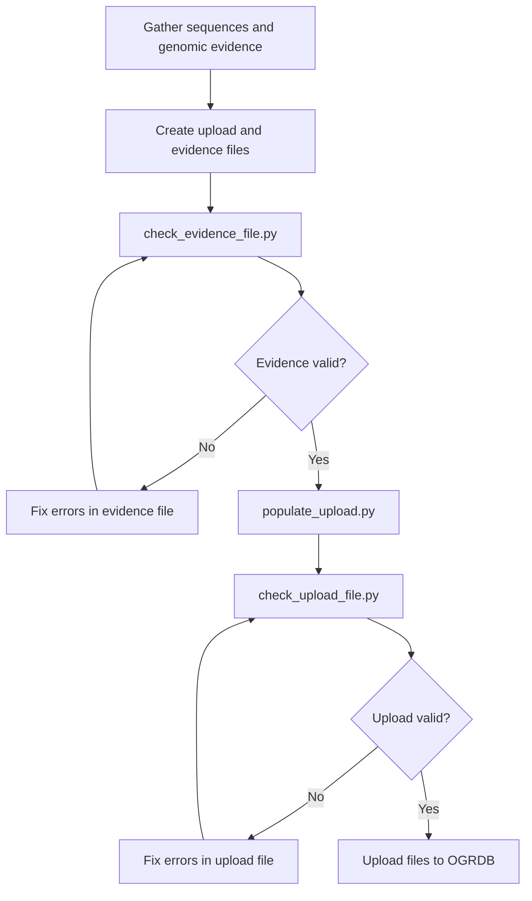

# OGRDB Contribution Tools

This repository provides tools for creating and validating sequence submission files for the [Open Germline Receptor Database (OGRDB)](https://ogrdb.airr-community.org/). The tools help researchers prepare genomic evidence and sequence upload files that meet OGRDB's requirements.

Uploading sequences is the first step in creating or updating germline sets. Once the sequences are uploaded, they can be grouped into sets using tools in OGRDB itself. The sequence upload consists of two CSV files. One holds information on the sequences theselves (the upload file), and the other documents the genomic evidence supporting each sequence (the evidence file). Germline sets on OGRDB hold to different standards, depending on the available evidence for the species in question. Genomic evidence is not required for all species, or for all sequences in a submission, but it is strongly preferred and should be provided if available.

## Prerequisites

Before using these tools, you need:

1. **A set of allele sequences** with assigned names
2. **Gapped sequences for V alleles** (IMGT-gapped format. See notes on gapping at the end of this document)
3. **Genomic evidence** for alleles with genomic inference type, including:
   - Repository accession numbers (preferably GenBank)
   - Precise coordinates of each sequence within genomic records
   - GenBank records are preferred as they can be more easily verified.

## Required Software Dependencies

- Python 3.9+
- `receptor-utils` library
- `biopython` library

Install dependencies:
```bash
pip install -r requirements.txt
```

## Process Overview

The OGRDB submission process follows these steps:



### Step-by-step Process

A general note on file formats: The files should be Microsoft standard CSV files. If you prepare the files in Excel, please save as CSV (Comma delimited) and not CSV UTF-8 (Comma delimited) as the latter introduces spurious characters into the file preventing it from being parsed correctly. 

Please ensure that fields do not contain leading or trailing spaces. The software will check for these and report them as errors if found.

1. **Prepare Upload File**: Populate `sequence_upload.csv` with allele details

Make a copy of the provided template `sequence_upload_blank.csv`. Create a row in the upload file for each allele to be submitted. At this point, just fill in the following fields for each allele:
- `gene_label`
- `imgt` (if applicable)
- `functionality`
- `type`
- `inference_type`  
- `sequence`
- `sequence_gapped` (for V genes)
- `species_subgroup` (if applicable)
- `subgroup_type` (if applicable)
- `alt_names` (if applicable)
- `affirmation` (must be 1)
- `chromosome` (if known)   
- `notes` (if applicable)
- `inferred_extension` (if applicable)
- `ext_3_prime` (if applicable)
- `ext_5_prime` (if applicable)
- `j_codon_frame` (for J genes)
- `j_cdr3_end` (for J genes)

Notes on the fields will be found in the table below.

2. **Create Evidence File**: Populate `sequence_evidence_blank.csv` with genomic evidence details

For each allele with an Unrearranged or Unrearranged and rearranged inference type, create one or more rows in the evidence file documenting the genomic evidence. Make a copy of the provided template `sequence_evidence_blank.csv`. Each row should include:
- `gene_label`
- `sequence`
- `sequence_type`
- `repository`
- `accession`
- `start`
- `end`
- `sense`
- `species_subgroup` (if applicable)
- `subgroup_type` (if applicable)
- `notes` (if applicable)
- `gene_start`
- `gene_end`
- Additional feature coordinates as applicable (e.g., `utr_5_prime_start`, `leader_1_start`, etc.). Please provide coordinates for all features you can identify from the evidence.

3. **Validate Evidence**: Run `check_evidence_file.py` to verify evidence file

This will verify that the evidence file is complete and consistent with the genomic sequences. It checks required fields, coordinate validity, feature adjacency, and sequence matching. Fix any reported errors before proceeding.

4. **Populate Upload File**: Run `populate_upload_file.py`

This will select evidence from the evidence file and populate the upload file with sequences and coordinates. It will check that evidence is available for all alleles. The script also creates coordinates in the upload file for sequences with rearranged-only inference type. Fix any reported errors before proceeding.

5. **Validate Upload**: Run `check_upload_file.py` to verify upload file completeness
6. **Upload**: Upload validated files to OGRDB


### Upload File (`sequence_upload_blank.csv`)

The upload file contains all alleles to be submitted to OGRDB. One row per allele.

| Field | Type | Required | Values | Description |
|-------|------|----------|--------|-------------|
| `gene_label` | String | ✅ Required | Any | Assigned name of the allele |
| `imgt` | String | Optional | IMGT name | IUIS name if issued |
| `functionality` | String | ✅ Required | F, ORF, P | Functional classification |
| `type` | String | ✅ Required | IGHV, IGHD, etc. | Locus and gene type (e.g., IGHV, TRBJ) |
| `inference_type` | String | ✅ Required | See below | Type of inference evidence |
| `sequence` | String | ✅ Required | DNA sequence | Complete annotated sequence |
| `sequence_gapped` | String | V genes only | Gapped sequence | IMGT-gapped V-REGION (V genes only) |
| `species_subgroup` | String | Optional | Agreed values | Strain/breed designation |
| `subgroup_type` | String | Optional | Agreed values | Subgroup type designation |
| `alt_names` | String | Optional | Comma-separated | Alternative names for this allele |
| `affirmation` | Integer | ✅ Required | 1 | Confirmation value (must be 1) |
| `chromosome` | String | Optional | Chromosome ID | Chromosome number or identifier |
| `paralogs` | String | Optional | Gene labels | Sequences with identical coding regions |
| `varb_rep` | String | Optional | Gene label | Representative allele for paralog group |
| `notes` | String | Optional | Any | Notes on functionality |
| `inferred_extension` | String | Optional | Y/blank | Sequence extended by homology |
| `ext_3_prime` | String | Optional | Sequence | 3' extension sequence |
| `ext_5_prime` | String | Optional | Sequence | 5' extension sequence |
| `curational_tags` | String | Optional | See below | Curational annotations |
| `mapped` | String | Optional | Y/blank | Y if genomic evidence allows the sequence to be mapped to the genome, blank otherwise |
| **Coordinate Fields** | Integer | Optional | ≥1 | Feature coordinates (relative to sequence start) |

Coordinate fields are as described in the evidence file section, but coordinates are relative to the start of the sequence (position 1).

#### Inference Types

| Value | Description | Evidence Required |
|-------|-------------|-------------------|
| `Unrearranged` | Genomic evidence only | Must have matching evidence file entry |
| `Unrearranged and rearranged` | Both genomic and rearranged evidence | Must have matching evidence file entry |
| `Rearranged only` | Inferred from rearranged sequences | No genomic evidence required |

#### Functionality Classifications

| Value | Description |
|-------|-------------|
| `F` | Functional (no stop codons, proper reading frame) |
| `ORF` | Open reading frame (no stop codons in coding region) |
| `P` | Pseudogene (contains stop codons or frameshifts) |

#### Curational Tags

For inferred repertoires only:
- `likely_truncated`: Sequence likely incomplete
- `likely_full_length`: Sequence likely complete
- Leave blank for other circumstances

## File Formats

### Evidence File (`sequence_evidence_blank.csv`)

The evidence file documents genomic evidence for each allele. Each row represents one piece of evidence.

| Field | Type | Required | Values | Description |
|-------|------|----------|--------|-------------|
| `gene_label` | String | ✅ Required | Any | Assigned name of the allele |
| `sequence` | String | ✅ Required | DNA sequence | Complete annotated sequence (5' to 3') |
| `sequence_type` | String | ✅ Required | V, D, J, C | Type of immunoglobulin/TCR gene |
| `repository` | String | ✅ Required | GenBank, EMBL, etc. | Repository designation |
| `accession` | String | ✅ Required | Accession ID | Repository accession identifier |
| `patch` | String | Optional | Version number | Patch/version level in repository |
| `start` | Integer | ✅ Required | ≥1 | Start coordinate in genomic sequence |
| `end` | Integer | ✅ Required | >start | End coordinate in genomic sequence |
| `sense` | String | ✅ Required | +, - | Orientation of deposited sequence: + is 5' to 3' |
| `species_subgroup` | String | Optional | Agreed values | Strain/breed designation |
| `subgroup_type` | String | Optional | Agreed values | Subgroup type designation |
| `notes` | String | Optional | Any | Additional notes |
| `gene_start` | Integer | ✅ Required | ≥1 | Start of core coding sequence |
| `gene_end` | Integer | ✅ Required | >gene_start | End of core coding sequence |
| `utr_5_prime_start` | Integer | Optional | ≥1 | Start of 5' UTR |
| `utr_5_prime_end` | Integer | Optional | >utr_5_prime_start | End of 5' UTR |
| `leader_1_start` | Integer | Optional | ≥1 | Start of leader sequence 1 |
| `leader_1_end` | Integer | Optional | >leader_1_start | End of leader sequence 1 |
| `leader_2_start` | Integer | Optional | ≥1 | Start of leader sequence 2 |
| `leader_2_end` | Integer | Optional | >leader_2_start | End of leader sequence 2 |
| `v_rs_start` | Integer | Optional | ≥1 | Start of V recombination signal |
| `v_rs_end` | Integer | Optional | >v_rs_start | End of V recombination signal |
| `d_rs_3_prime_start` | Integer | Optional | ≥1 | Start of D 3' recombination signal |
| `d_rs_3_prime_end` | Integer | Optional | >d_rs_3_prime_start | End of D 3' recombination signal |
| `d_rs_5_prime_start` | Integer | Optional | ≥1 | Start of D 5' recombination signal |
| `d_rs_5_prime_end` | Integer | Optional | >d_rs_5_prime_start | End of D 5' recombination signal |
| `j_codon_frame` | Integer | Optional | 1, 2, 3 | Reading frame for J gene |
| `j_rs_start` | Integer | Optional | ≥1 | Start of J recombination signal |
| `j_rs_end` | Integer | Optional | >j_rs_start | End of J recombination signal |
| `j_cdr3_end` | Integer | Optional | ≥1 | End of CDR3 region (WGG/FGG motif) |

#### Coordinate Requirements

- All coordinates are **1-based inclusive**
- Coordinates should follow genomic sequence orientation, with start < end regardless of orientation
- `sequence` is always reported in 5' to 3' orientation

## Script Documentation

### `check_evidence_file.py`

Validates evidence files against genomic sequences from GenBank or local FASTA files.

#### Usage

```bash
# Check evidence file using GenBank (downloads sequences)
python check_evidence_file.py evidence.csv --email your@email.com

# Check evidence file using local FASTA files
python check_evidence_file.py evidence.csv --use-local

# Download and save sequences for future use
python check_evidence_file.py evidence.csv --email your@email.com --save-sequences
```

#### Validation Checks

- **Required fields**: Ensures mandatory fields are completed
- **Field validation**: Checks enumerated values and data types
- **Coordinate validation**: Verifies coordinates are positive integers with start < end
- **Adjacency validation**: Checks that features are properly adjacent
- **Sequence matching**: Compares sequences against genomic references (handles reverse complement)

#### Arguments

| Argument | Description |
|----------|-------------|
| `evidence_file` | Path to evidence CSV file |
| `--use-local` | Read sequences from local FASTA files instead of GenBank |
| `--email` | Email address for GenBank queries (required by NCBI) |
| `--save-sequences` | Save downloaded GenBank sequences to FASTA files |

When using `--use-local`, the script expects FASTA files named `<accession>.fasta` in the current directory.

### `transfer_evidence_to_upload.py`

Transfers genomic evidence data from evidence files to upload files, with automatic coordinate transformation.

#### Usage

```bash
# Transfer evidence data to upload file
python transfer_evidence_to_upload.py evidence.csv upload.csv
```

#### Features

- **Automatic evidence matching**: When repository/accession are blank, finds best evidence match
- **Coordinate transformation**: Converts assembly coordinates to sequence-relative coordinates
- **Feature selection**: Chooses evidence with most annotated features when multiple options exist
- **Backup creation**: Creates backup before modifying upload files

#### Process

1. Reads evidence file and creates lookup dictionary
2. Processes each upload file row with genomic inference type
3. Finds matching evidence entries (exact match or automatic)
4. Transfers sequences and transforms coordinates
5. Updates upload file with genomic evidence data

#### Coordinate Transformation

Coordinates are transformed from genomic assembly coordinates to sequence-relative coordinates:
- Evidence file coordinates are relative to GenBank assembly
- Upload file coordinates are relative to sequence start (position 1)
- Handles both plus and minus sense orientations
- Maintains proper feature adjacency relationships

### `check_upload_file.py`

Validates upload files for completeness and consistency with evidence files.

#### Usage

```bash
# Validate upload file against evidence file
python check_upload_file.py evidence.csv upload.csv
```

#### Validation Checks

**Consistency checks (all rows):**
- Required fields have appropriate values
- V genes have gapped sequences with proper gap structure
- Coordinate pairs have valid integer values with start < end
- Features are adjacent according to gene type rules

**Rearranged-only inference checks:**
- Only gene_start, gene_end completed (plus j_cdr3_end for J genes)
- No other coordinate fields have values

**Genomic inference checks:**
- Matching evidence record exists
- Sequences match between files
- Feature coordinates denote sequences of equal length
- J gene j_cdr3_end values match

## Error Handling and Troubleshooting

### Common Error Types

1. **Missing required fields**: Complete all mandatory fields in templates
2. **Invalid coordinates**: Ensure start < end and all coordinates are positive integers
3. **Sequence mismatches**: Verify sequences match between evidence and GenBank/upload files
4. **Adjacency violations**: Check that features are properly adjacent according to gene type rules
5. **Missing evidence**: Ensure evidence file contains entries for all genomic inference types

### Validation Process

1. Run `check_evidence_file.py` first to validate evidence
2. Fix any reported errors before proceeding
3. Use `transfer_evidence_to_upload.py` to populate upload file
4. Run `check_upload_file.py` to validate final upload file
5. Fix any issues and re-validate before submission

### Tips

- Use `--save-sequences` flag to save GenBank sequences and save time on subsequent runs
- Ensure inference types match available evidence

## Notes on V gene gapping

In the IMGT scheme, which OGRDB follows, amino acid sequences of V-genes are aligned. Strongly conserved
residues and motifs are aligned across all V-genes in a species, and gaps are introduced to achieve this. These gaps are reverse-translated into the nucleotide sequence to create the V-gapped sequence.

You can find notes on conserved residues and motifs in the [IMGT documentation](https://www.imgt.org/PDF/DCI/27_55-77_2003.pdf) and in Andrew Martin's [rules for identifying CDRs](http://www.bioinf.org.uk/abs/IMGT_V-QUEST_help.html). In the IMGT scheme, CDR1, CDR2 and the start of CDR3 are found at uniform amino acid locations within the alignment. The [default](https://www.imgt.org/IMGTScientificChart/Nomenclature/IMGT-FRCDRdefinition.html) locations, are used for all human loci. Other species may require additional insertions. In OGRDB, only functional and ORF sequences are aligned, pseudogenes are not considered.

If a set of gapped sequences is already available for your species and loci, or if a set is available for a similar species, you can use these to derive an alignment for your sequences using the [receptor-utils](https://github.com/williamdlees/receptor_utils) tool `gap_sequences`. Whether you use this approach or start from scratch, please review the resulting alignment carefully and confirm the accurate alignment of conserved residues and motifs, and deduce the consequent location of CDRs. OGRDB will use the default locations mentioned above, but you can specify different locations when uploading the sequence file.

## Example Workflow

```bash
# 1. Validate evidence file
python check_evidence_file.py my_evidence.csv --email user@example.com

# 2. Transfer evidence to upload file  
python transfer_evidence_to_upload.py my_evidence.csv my_upload.csv

# 3. Validate final upload file
python check_upload_file.py my_evidence.csv my_upload.csv

# 4. Submit validated files to OGRDB
```

## File Templates

Template files are provided in the `templates/` directory:
- `sequence_evidence_blank.csv`: Evidence file template
- `sequence_upload_blank.csv`: Upload file template

Copy these templates and populate with your data following the field specifications above.

## Support

For questions about OGRDB submission requirements, consult the [OGRDB documentation](https://ogrdb.airr-community.org/) or use the OGRDB website contact details to obtain help.

